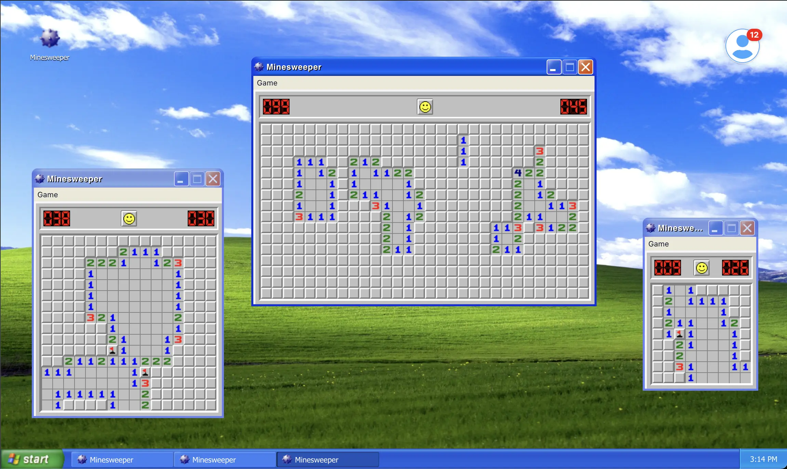

# Iiiiit's Minesweeper!

[View Demo](https://scottjhetrick.com/#/minesweeper)

Welcome to **Minesweeper**, a sophisticated and feature-rich implementation of the classic Minesweeper game built using React and Vite. This application is an integral part of a larger monorepo, leveraging shared systems such as the **dread-ui** component library and an **Achievements System** to enhance functionality and user engagement.

## Table of Contents

- [Features](#features)
- [Architecture](#architecture)
  - [Component Structure](#component-structure)
  - [State Management](#state-management)
  - [Context Providers](#context-providers)
  - [Integration with Shared Systems](#integration-with-shared-systems)
- [Technologies](#technologies)
- [Key Components](#key-components)
  - [Grid and Cells](#grid-and-cells)
  - [Score Bar](#score-bar)
  - [Taskbar](#taskbar)
  - [Window Management](#window-management)
  - [Achievements System](#achievements-system)
- [Best Practices](#best-practices)

## Features

- **Classic Minesweeper Gameplay**: Engage with the timeless challenge of clearing mines without detonating any.
- **Responsive Design**: Optimized for various screen sizes and devices to ensure a seamless gaming experience.
- **Drag-and-Drop Windows**: Manage multiple game instances with draggable and focusable windows for enhanced multitasking.
- **Achievements System**: Unlock achievements based on your gameplay performance, fostering a sense of accomplishment.
- **Taskbar Integration**: Easily navigate between open game windows using an intuitive taskbar interface.
- **Customizable Difficulty**: Choose between Beginner, Intermediate, and Expert levels to match your skill level.
- **Real-Time Timer and Mine Counter**: Keep track of your progress with a dynamic timer and mine counter.
- **Interactive UI Components**: Built with the reusable **dread-ui** component library for consistent and maintainable UI elements.

## Architecture

**Minesweeper** is thoughtfully architected to ensure scalability, maintainability, and seamless integration within the monorepo environment. Below is an overview of its architectural components and design principles.

### Component Structure

The application follows a modular component-based architecture, breaking down the UI into reusable and manageable pieces. Key components include:

- **Grid and Cells**: Represent the Minesweeper grid and individual cells, handling game logic and user interactions.
- **Score Bar**: Displays the mine counter, game timer, and reset button (smiley face).
- **Taskbar**: Manages open game windows, allowing users to switch between multiple instances.
- **Window Management**: Handles the creation, dragging, focusing, minimizing, and closing of game windows.

### State Management

State within the application is managed using React's built-in state hooks and context providers. This ensures a predictable and centralized state flow, making it easier to manage complex interactions and data sharing between components.

### Context Providers

Two primary context providers are utilized:

1. **AppProvider**: Manages global application state, including open apps, focused app, and taskbar interactions.
2. **MinesweeperProvider**: Handles game-specific state such as grid data, game status, timer, and achievements.

### Integration with Shared Systems

The application integrates seamlessly with shared systems within the monorepo:

- **dread-ui**: A reusable component library that provides consistent UI elements across different applications.
- **Achievements System**: A centralized system that tracks and unlocks achievements based on user interactions and gameplay milestones.

## Technologies

- **React**: Frontend library for building dynamic user interfaces.
- **Vite**: Fast and lean development tooling for modern web projects.
- **TypeScript**: Provides static typing to enhance code quality and developer experience.
- **ESLint**: Ensures code quality and consistency through linting.
- **Tailwind CSS**: Utility-first CSS framework for rapid UI development.
- **dread-ui**: Custom component library for shared UI elements from the parent monorepo.
- **@use-gesture/react**: Handles complex gesture interactions for draggable windows.
- **uuid**: Generates unique identifiers for managing multiple app instances.

## Key Components

### Grid and Cells

- **Grid (`grid.tsx`)**: Manages the overall Minesweeper grid, rendering individual cells and handling interactions.
- **Cell (`cell.tsx`)**: Represents each cell in the grid, managing its state (hidden, revealed, flagged) and rendering appropriate visuals based on game status.

### Score Bar

- **DigitDisplay (`digit-display.tsx`)**: Displays numerical values (e.g., mine count, timer) using custom digit images for an authentic Minesweeper feel.
- **ScoreBar (`score-bar.tsx`)**: Integrates the mine counter, timer, and smiley reset button, providing a central HUD for the game.

### Taskbar

- **Taskbar (`taskbar.tsx`)**: Mimics a desktop taskbar, displaying open game windows and providing quick navigation.
- **TaskbarWindow (`taskbar-window.tsx`)**: Represents individual window entries within the taskbar, handling focus and interaction states.
- **TaskbarTime (`taskbar-time.tsx`)**: Shows the current system time, maintaining a desktop-like experience.

### Window Management

- **Window (`window.tsx`)**: Handles the creation and management of draggable game windows, integrating with the **AppProvider** for state management.
- **Header (`header.tsx`)**: The window's header bar, including the application icon, title, and control buttons (minimize, close).

### Achievements System

- **useAchievements Hook**: Interfaces with the shared achievements system, unlocking achievements based on user actions and game outcomes.
- **Achievements Integration**: Embedded within various components to trigger achievement unlocks (e.g., flagging a mine, winning a game).

## Best Practices

To ensure a robust and maintainable codebase, the following best practices are adhered to:

1. **Modular Component Design**: Components are designed to be reusable and self-contained, promoting scalability and ease of testing.
2. **Type Safety with TypeScript**: Leveraging TypeScript interfaces and types to prevent runtime errors and enhance developer experience.
3. **Centralized State Management**: Utilizing context providers to manage global and game-specific states, ensuring a predictable state flow.
4. **Separation of Concerns**: Distinct separation between UI components, game logic, and shared systems to maintain clarity and reduce coupling.
5. **Responsive and Accessible Design**: Ensuring that the UI is both responsive to different screen sizes and accessible to all users.
6. **Comprehensive Linting and Formatting**: Implementing ESLint and adhering to consistent coding standards to maintain code quality and readability.
7. **Efficient Asset Management**: Organizing assets systematically, leveraging tools like SVGR for SVG handling to optimize performance and maintainability.
